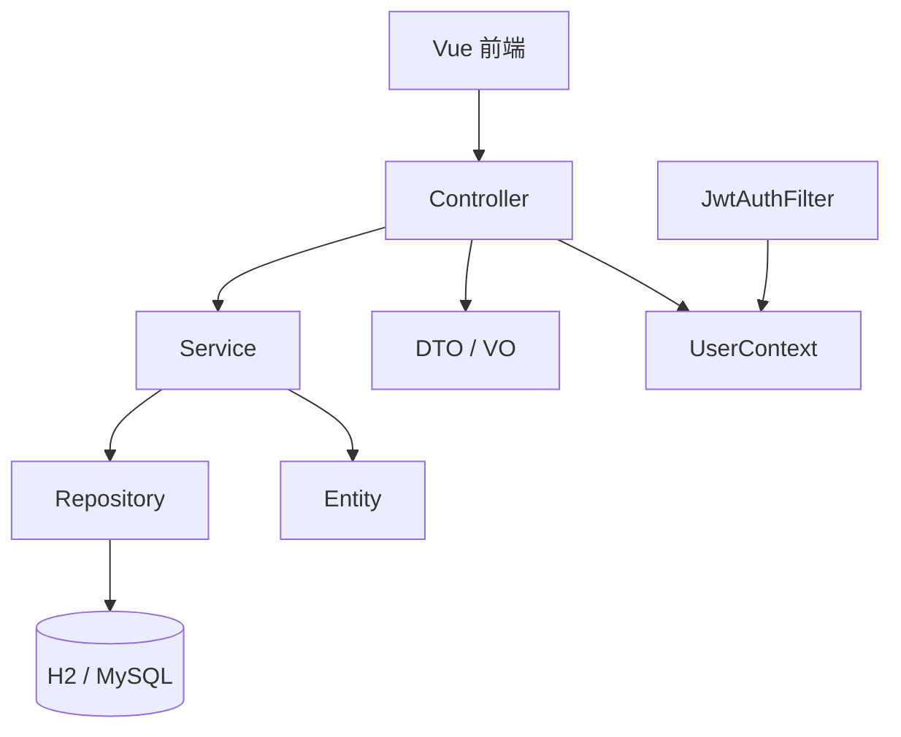
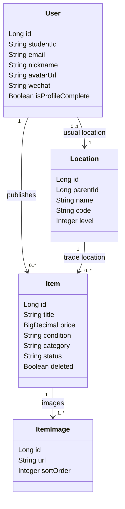
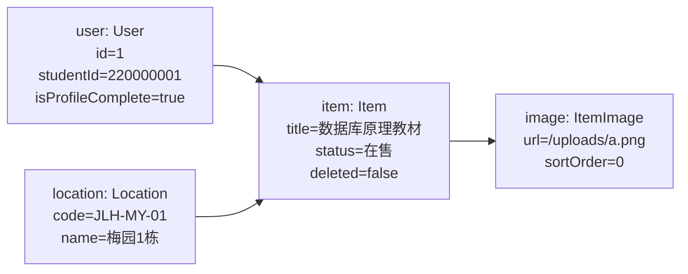
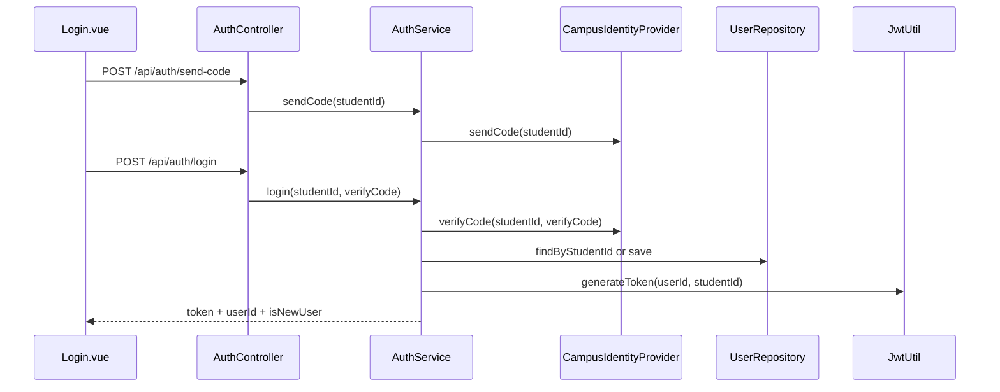
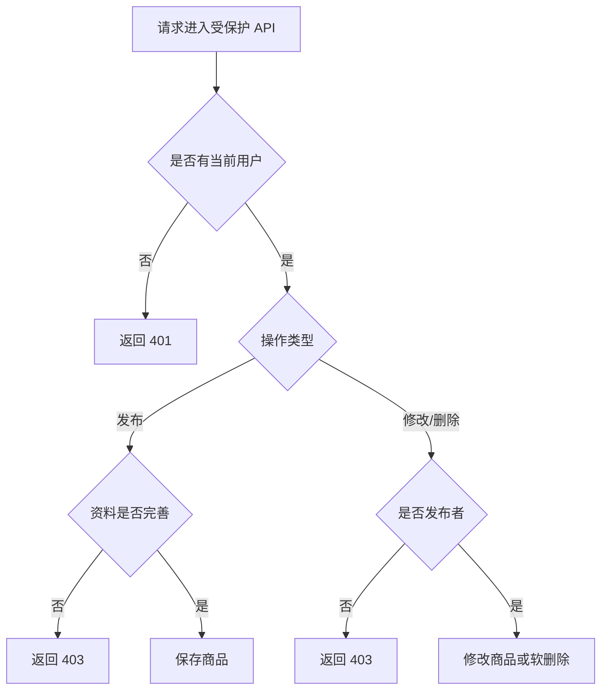

# 后端 A 开发规格说明书

> 本文档是后端开发 A 的开发依据，覆盖基础架构、安全认证、用户权限控制、商品 CRUD、图片上传、地点树、测试验收与报告图表。团队分工 PDF 中曾写明 Python Flask，但当前项目已经基于 Spring Boot 完成主体实现；为避免重构风险和报告/代码不一致，本项目后端 A 以当前 Spring Boot 技术栈为准。

## 1. 职责边界

### 1.1 后端 A 负责

- 后端基础架构：Spring Boot 分层结构、统一响应、异常处理、配置管理。
- 安全机制：JWT 登录态、开发期认证开关、受保护 API 拦截。
- 校园身份认证抽象：预留统一身份认证 Provider，当前用一卡通号 + 验证码模拟。
- 用户权限控制：当前用户识别、资料完善状态、商品所有权校验。
- 商品能力：列表、详情、发布、修改、下架/软删除、我的发布。
- 图片上传：图片类型、大小、扩展名校验，本地保存并暴露静态 URL。
- 地点树：校区/园区/楼栋三级地点数据，适配前端级联选择器。
- 报告材料：《系统设计》安全机制说明，《程序开发》类图、对象图、代码组织结构。

### 1.2 后端 B 负责

- 商品预定、取消预定、订单状态流转。
- 超卖控制、并发锁定、事务级订单一致性。
- 收藏、私信、系统通知。
- 交易闭环相关数据库表和业务流程。

## 2. 技术栈与运行环境

| 类型 | 选型 | 用途 |
|---|---|---|
| Web 框架 | Spring Boot | REST API 与应用启动 |
| 安全框架 | Spring Security | 认证拦截、异常入口 |
| 数据访问 | Spring Data JPA | Entity/Repository 持久化 |
| 数据库 | H2 / MySQL | H2 用于开发测试，MySQL 用于真实环境 |
| 登录态 | JWT | 无状态身份凭证 |
| 测试 | JUnit + MockMvc | API 级集成测试 |

默认 `application.yml` 使用 H2 内存库并开启开发期认证；`application-mysql.yml` 关闭开发期认证，避免生产环境误用 `X-Dev-User-Id`。

## 3. 代码组织结构

```text
backend/src/main/java/Market_backend
├── common      统一响应、业务异常、当前用户上下文
├── config      Spring Security、JWT、静态资源、数据初始化
├── controller  REST API 入口
├── dto         请求体与响应体
├── entity      JPA 实体
├── repository  数据访问接口
└── service     业务逻辑与事务边界
```

分层规则：

- Controller 只负责接收参数、调用 Service、封装 `Result<T>`。
- Service 负责业务校验、权限判断、事务和实体转换。
- Repository 只负责数据库读写。
- Entity 不暴露给前端，前端只接收 VO/DTO。
- Config/Common 放跨模块能力，不写具体商品业务。

## 4. 统一响应与错误约定

成功响应固定为：

```json
{
  "code": 0,
  "message": "ok",
  "data": {}
}
```

业务错误使用 HTTP 200 + 非 0 `code`：

| code | 含义 | 场景 |
|---|---|---|
| 400 | 参数或业务输入错误 | 验证码错误、地点不存在、文件类型非法 |
| 401 | 未登录 | 当前请求没有 JWT，也没有启用的开发期身份 |
| 403 | 无权限 | 未完善资料、非发布者修改/删除商品 |
| 404 | 资源不存在 | 用户不存在、商品不存在或已删除 |
| 500 | 服务端错误 | 未预期异常、文件保存失败 |

Spring Security 未认证入口返回 HTTP 401，同时 body 使用统一响应格式：

```json
{ "code": 401, "message": "请先登录", "data": null }
```

## 5. 安全与认证机制

### 5.1 正式认证

登录成功后后端签发 JWT，前端后续请求携带：

```http
Authorization: Bearer <token>
```

`JwtAuthFilter` 校验 token 后取出用户 ID，写入 `UserContext` 和 Spring Security 上下文。业务层通过 `UserContext.getUserId()` 获取当前用户。

### 5.2 开发期认证

本地联调可使用：

```http
X-Dev-User-Id: 1
```

该能力由配置项控制：

```yaml
app:
  security:
    dev-auth-enabled: true
```

规则：

- JWT 优先于 `X-Dev-User-Id`。
- `dev-auth-enabled=true` 时，缺少 JWT 才读取 `X-Dev-User-Id`。
- `dev-auth-enabled=false` 时，完全忽略 `X-Dev-User-Id`。
- `application-mysql.yml` 中必须关闭开发期认证。

### 5.3 路径放行

| 路径 | 是否需要认证 | 原因 |
|---|---|---|
| `/api/health` | 否 | 健康检查 |
| `/api/auth/**` | 否 | 登录前需要发送/校验验证码 |
| `/uploads/**` | 否 | 商品图片需要前端直接访问 |
| `/api/**` 其他路径 | 是 | 涉及用户、商品、上传等业务资源 |

## 6. 校园身份认证抽象

当前课程阶段不直接接入真实校园 SSO，而是用抽象接口保留替换点：

| 组件 | 职责 |
|---|---|
| `CampusIdentityProvider` | 定义发送验证码、校验验证码、构造校园邮箱 |
| `VerificationCodeCampusIdentityProvider` | 当前实现，使用一卡通号和验证码模拟认证 |
| `VerificationCodeStore` | 保存验证码、过期时间和发送间隔 |
| `AuthService` | 调用 Provider，创建/读取用户，签发 JWT |

后续接入真实统一身份认证时，只新增一个 Provider 实现并替换当前实现，不改用户、商品、上传模块。

## 7. 数据模型

### 7.1 User

| 字段 | 含义 |
|---|---|
| `id` | 用户主键 |
| `studentId` | 9 位一卡通号，唯一 |
| `email` | 校园邮箱 |
| `nickname` | 集市昵称 |
| `avatarUrl` | 头像 URL |
| `wechat` | 微信号 |
| `location` | 常驻地点 |
| `isProfileComplete` | 资料是否完善 |

### 7.2 Location

| 字段 | 含义 |
|---|---|
| `id` | 地点主键 |
| `parentId` | 上级地点 ID |
| `name` | 地点名称 |
| `code` | 地点编码，唯一 |
| `level` | 层级，1 校区、2 园区、3 楼栋 |

### 7.3 Item

| 字段 | 含义 |
|---|---|
| `id` | 商品主键 |
| `seller` | 发布者 |
| `location` | 面交地点 |
| `title` | 商品标题 |
| `price` | 售价 |
| `condition` | 成色 |
| `category` | 分类 |
| `description` | 描述 |
| `coverImageUrl` | 封面图 |
| `status` | `在售` 或 `已下架` |
| `wantCount` | 想要人数 |
| `viewCount` | 浏览次数 |
| `deleted` | 软删除标记 |

### 7.4 ItemImage

| 字段 | 含义 |
|---|---|
| `id` | 图片主键 |
| `item` | 所属商品 |
| `url` | 图片 URL |
| `sortOrder` | 展示顺序 |

## 8. API 规格

### 8.1 健康检查

`GET /api/health`

- 鉴权：否
- 响应：`data = "backend is running"`
- 前端页面：环境连通性检查

### 8.2 发送验证码

`POST /api/auth/send-code`

- 鉴权：否
- Body：

```json
{ "studentId": "220000001" }
```

- 校验：`studentId` 必须是 9 位数字。
- 成功：`data = null`
- 失败：验证码发送过于频繁返回 `code=400`。
- 前端页面：`Login.vue`

### 8.3 登录

`POST /api/auth/login`

- 鉴权：否
- Body：

```json
{ "studentId": "220000001", "verifyCode": "123456" }
```

- 成功响应：

```json
{
  "token": "jwt-token",
  "userId": 1,
  "isNewUser": false
}
```

- 失败：验证码错误或过期返回 `code=400`。
- 前端页面：`Login.vue`

### 8.4 当前用户资料

`GET /api/users/me`

- 鉴权：是
- 成功响应包含：`id`、`studentId`、`email`、`nickname`、`avatarUrl`、`wechat`、`locationCode`、`locationText`、`isProfileComplete`。
- 前端页面：`Profile.vue`

### 8.5 更新当前用户资料

`PUT /api/users/me`

- 鉴权：是
- Body：

```json
{
  "nickname": "东大淘货王",
  "wechat": "seu_market_01",
  "locationCode": "JLH-MY-01",
  "avatarUrl": "https://example.com/avatar.png"
}
```

- 规则：`locationCode` 必填；未传 `avatarUrl` 时保留原头像。
- 成功：`isProfileComplete=true`。
- 前端页面：`Onboarding.vue`、`Profile.vue`

### 8.6 地点树

`GET /api/locations/tree`

- 鉴权：是
- 响应字段：`id`、`text`、`value`、`level`、`children`。
- 规则：叶子节点不返回空 `children`，适配 Vant Cascader。
- 前端页面：`Onboarding.vue`、`Publish.vue`

### 8.7 商品列表

`GET /api/items?category=&keyword=&status=`

- 鉴权：是
- 默认规则：未传 `status` 时只返回未删除且 `status=在售` 的商品。
- 筛选：
  - `category` 精确匹配。
  - `keyword` 模糊匹配标题、描述、卖家昵称。
  - `status` 精确匹配。
- 响应字段：`id`、`title`、`price`、`condition`、`category`、`image`、`sellerName`、`sellerAvatar`、`wantCount`、`location`、`status`、`createdAt`。
- 前端页面：`Home.vue`、`Detail.vue` 推荐列表

### 8.8 商品详情

`GET /api/items/{id}`

- 鉴权：是
- 规则：商品不存在或已删除返回 `code=404`；查询成功后浏览量加 1。
- 响应：列表字段 + `description`、`sellerId`、`viewCount`、`images`。
- 前端页面：`Detail.vue`

### 8.9 我的发布

`GET /api/items/mine`

- 鉴权：是
- 规则：返回当前用户未删除商品，按发布时间倒序。
- 前端页面：`Profile.vue`

### 8.10 发布商品

`POST /api/items`

- 鉴权：是
- Body：

```json
{
  "title": "数据库原理教材",
  "category": "专业书籍",
  "condition": "9成新",
  "price": 25.00,
  "locationCode": "JLH-MY-01",
  "description": "课程用书，少量划线",
  "imageUrls": ["/uploads/a.png"]
}
```

- 规则：用户资料必须完善；图片 1 到 6 张；首图为封面。
- 失败：资料未完善返回 `code=403`。
- 前端页面：`Publish.vue`

### 8.11 修改商品

`PUT /api/items/{id}`

- 鉴权：是
- Body：同发布商品。
- 规则：仅发布者可修改，非发布者返回 `code=403`。
- 前端页面：后续商品管理扩展

### 8.12 删除商品

`DELETE /api/items/{id}`

- 鉴权：是
- 规则：仅发布者可删除；删除为软删除，设置 `status=已下架`、`deleted=true`。
- 前端页面：后续商品管理扩展

### 8.13 上传图片

`POST /api/upload/image`

- 鉴权：是
- Content-Type：`multipart/form-data`
- 字段名：`file`
- 规则：
  - 文件非空。
  - 单文件不超过 5MB。
  - `Content-Type` 必须以 `image/` 开头。
  - 扩展名必须是 `jpg`、`jpeg`、`png`、`gif`、`webp`。
- 成功响应：

```json
{ "url": "/uploads/uuid.png" }
```

- 前端页面：`Publish.vue`

## 9. 权限规则

| 场景 | 规则 |
|---|---|
| 查询用户资料 | 必须登录 |
| 更新用户资料 | 只能更新当前用户 |
| 查询地点树 | 必须登录 |
| 查询商品列表/详情 | 必须登录 |
| 发布商品 | 必须登录，且资料已完善 |
| 修改商品 | 必须是商品发布者 |
| 删除商品 | 必须是商品发布者 |
| 上传图片 | 必须登录 |

## 10. 图表

### 10.1 后端分层结构图



### 10.2 核心类图



### 10.3 商品发布对象图



### 10.4 登录认证时序图



### 10.5 商品发布/修改/删除权限流程图



## 11. 验收标准

- `./mvnw.cmd test` 通过。
- `npm run build` 通过。
- 登录、完善资料、发布商品、查看详情、查看我的发布可联调。
- `app.security.dev-auth-enabled=false` 时，`X-Dev-User-Id` 不生效。
- API 文档中的字段、路径、状态值与代码一致。
- 最终报告章节不再出现 Flask/Spring Boot 混写。
