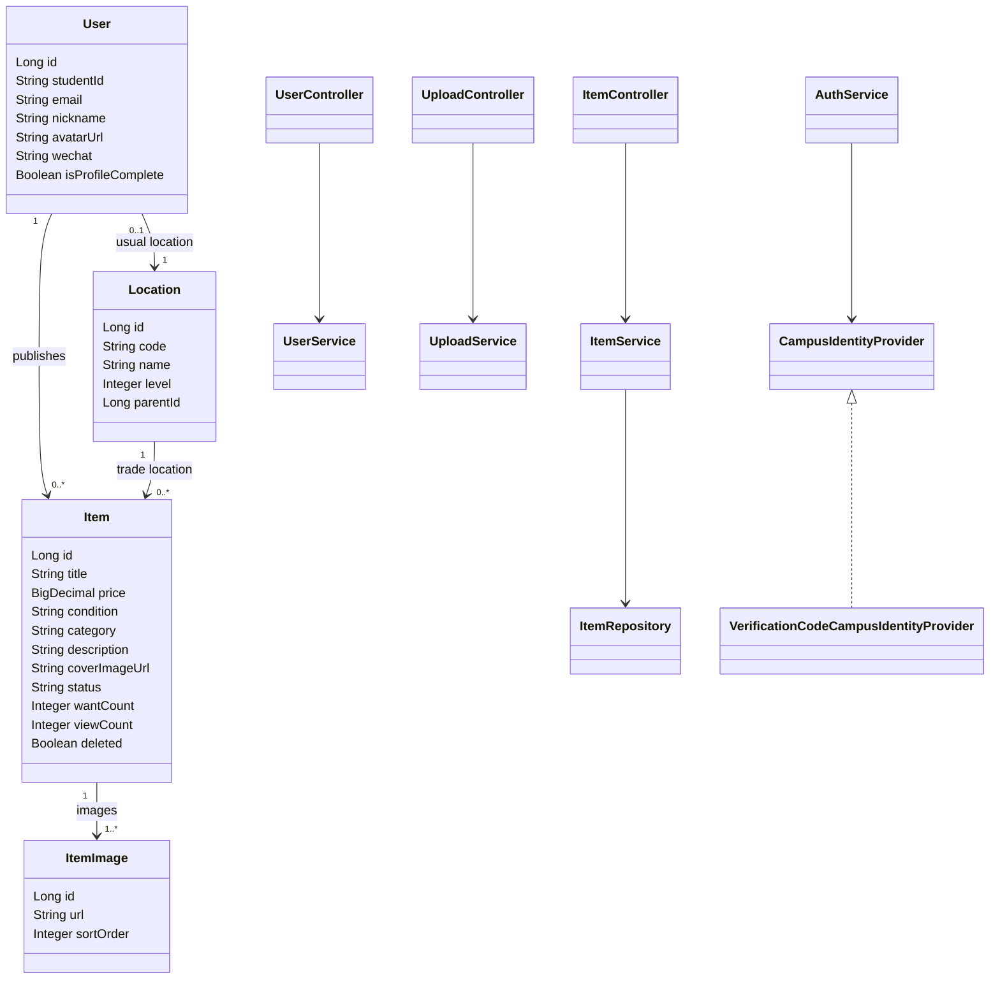
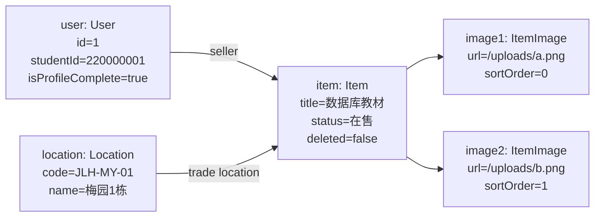
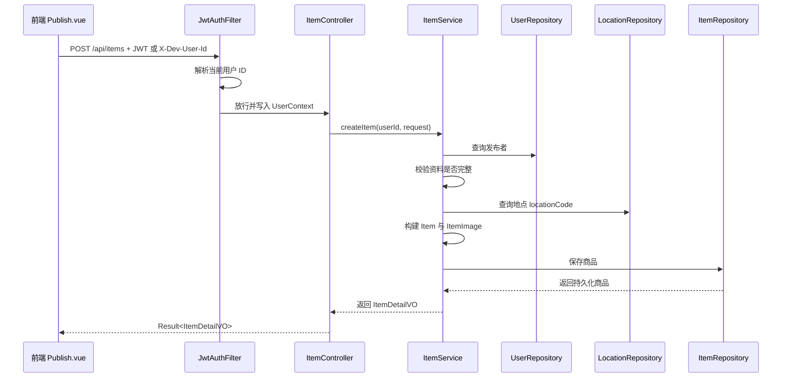
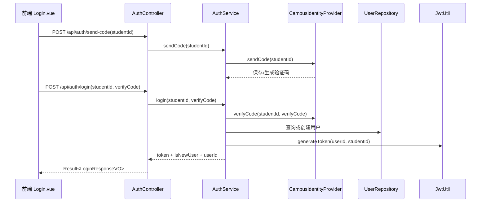

# 团队最终报告补充章节：后端开发 A 负责部分

> 本章节用于并入团队最终报告，覆盖后端开发 A 在分工中负责的《系统设计》和《程序开发》内容。预定、收藏、消息、通知、订单状态流转等交易闭环能力由后端开发 B 负责，本章节仅描述本项目的基础架构、安全、用户权限、商品 CRUD、图片上传和前后端接口对接部分。

## 一、系统设计：后端基础架构与安全机制

### 1. 后端基础架构设计

本项目后端采用 Spring Boot + Spring Data JPA + Spring Security 的分层架构，面向前端提供 REST API。整体结构按 Controller、Service、Repository、Entity、DTO、Config、Common 分层组织：

| 层次 | 作用 | 后端 A 相关内容 |
|---|---|---|
| Controller | 对外暴露 HTTP API，完成参数接收和统一响应封装 | 认证、用户资料、地点树、商品、图片上传接口 |
| Service | 承载业务规则和事务边界 | 登录认证、用户资料更新、商品发布/修改/下架、图片保存 |
| Repository | 通过 JPA 访问数据库 | 用户、地点、商品数据读写 |
| Entity | 描述数据库实体及关联关系 | `User`、`Location`、`Item`、`ItemImage` |
| DTO/VO | 定义请求体和响应体 | 商品发布请求、商品列表/详情、用户资料、地点树、上传结果 |
| Config | 系统配置与横切能力 | Spring Security、JWT、静态资源映射、数据初始化 |
| Common | 通用基础能力 | 统一响应 `Result<T>`、业务异常、当前用户上下文 |

默认开发和演示环境使用 H2 内存数据库，避免成员本机 MySQL 环境差异影响启动；如需连接真实 MySQL，可使用 `application-mysql.yml` 中的 `mysql` profile。初始化数据仅包含宿舍地点树和一个开发期默认用户，不预置商品数据；商品数据通过发布接口产生，接口测试也由测试用例自行构造商品。图片文件保存到后端本地 `uploads` 目录，并映射为 `/uploads/...` 静态资源路径。

### 2. 统一响应与异常处理设计

后端接口统一使用如下响应格式：

```json
{
  "code": 0,
  "message": "ok",
  "data": {}
}
```

业务错误不直接暴露 Java 异常栈，而是通过 `BusinessException` 和 `GlobalExceptionHandler` 转换为统一业务响应。例如未登录返回 `code=401`，无权限返回 `code=403`，参数校验失败返回 `code=400`。这样前端可以通过统一请求封装处理成功、失败和提示信息。

### 3. 认证机制设计

本项目基础认证采用 JWT 无状态认证方式，登录成功后由后端生成 Token，前端后续请求通过：

```http
Authorization: Bearer <token>
```

携带用户身份。后端通过 `JwtAuthFilter` 解析 Token，将用户 ID 写入 `UserContext`，业务层再基于当前用户执行权限判断。

考虑到课程项目中前后端并行开发的需要，后端同时保留开发期认证入口：

```http
X-Dev-User-Id: 1
```

该请求头仅用于本地调试，使前端商品发布、资料完善等功能可以在登录流程尚未完整联调时提前验证。正式路径仍以 JWT 为主。

安全放行与拦截规则如下：

| 路径 | 是否需要认证 | 设计原因 |
|---|---|---|
| `/api/health` | 否 | 用于服务健康检查 |
| `/api/auth/**` | 否 | 登录、发送验证码需要开放 |
| `/uploads/**` | 否 | 商品图片需要前端直接访问 |
| `/api/**` 其他路径 | 是 | 保护用户资料、商品发布、上传等业务接口 |

### 4. 校园身份认证扩展设计

按项目设想，系统需要支持校园统一身份认证。当前课程演示阶段未直接接入真实校园 SSO，而是通过接口抽象预留扩展点：

| 组件 | 作用 |
|---|---|
| `CampusIdentityProvider` | 定义校园身份认证能力，包括发送验证码、校验验证码、构造校园邮箱 |
| `VerificationCodeCampusIdentityProvider` | 当前实现，使用一卡通号 + 验证码完成登录 |
| `AuthService` | 调用 Provider 完成身份校验，创建/读取用户并签发 JWT |

后续如果接入真实校园 SSO，只需要新增对应 Provider 实现，替换当前验证码 Provider，不需要调整用户、商品等业务模块。

### 5. 用户权限控制设计

后端 A 实现了基础用户权限规则：

| 场景 | 权限规则 |
|---|---|
| 查看商品列表/详情 | 需要登录；列表默认只返回在售且未删除商品 |
| 发布商品 | 必须登录，且用户资料 `isProfileComplete=true` |
| 修改商品 | 仅商品发布者可修改 |
| 下架商品 | 仅商品发布者可下架 |
| 更新个人资料 | 仅能更新当前登录用户资料 |
| 上传图片 | 需要登录，避免匿名上传文件 |

商品删除采用下架/软删除方式：发布者调用删除接口后，商品状态变为 `已下架`，并设置删除标记。普通商品列表和详情接口不再返回该商品，从而避免误展示已下架商品。

### 6. 商品与前端对接 API 设计

后端 A 根据前端商品首页、详情页、发布页、个人页的实际字段需求设计接口，保证前端可以从 mock 数据切换为真实接口。

| 接口 | 功能 | 前端对接页面 |
|---|---|---|
| `GET /api/items?category=&keyword=&status=` | 商品列表，支持分类、关键词、状态筛选 | 首页 `Home.vue` |
| `GET /api/items/{id}` | 商品详情，返回多图、描述、卖家、浏览数 | 详情页 `Detail.vue` |
| `POST /api/items` | 发布商品 | 发布页 `Publish.vue` |
| `PUT /api/items/{id}` | 修改商品基础信息和图片 | 后续商品管理扩展 |
| `DELETE /api/items/{id}` | 下架商品 | 后续商品管理扩展 |
| `GET /api/items/mine` | 当前用户发布的商品 | 个人页 `Profile.vue` |
| `POST /api/upload/image` | 上传商品图片 | 发布页 `Publish.vue` |
| `GET /api/locations/tree` | 获取宿舍地点树 | 新用户引导、发布页 |
| `PUT /api/users/me` | 完善或更新资料 | 新用户引导、个人页 |

商品列表响应字段与前端瀑布流卡片保持一致：

```json
{
  "id": 1,
  "title": "数据库教材",
  "price": 25.00,
  "condition": "9成新",
  "category": "专业书籍",
  "image": "/uploads/xxx.png",
  "sellerName": "东大淘货王",
  "sellerAvatar": "https://...",
  "wantCount": 0,
  "location": "九龙湖校区 / 梅园 / 梅园1栋",
  "status": "在售",
  "createdAt": "2026-06-18T10:00:00"
}
```

详情接口在列表字段基础上补充 `description`、`images`、`sellerId`、`viewCount`，满足详情页轮播图、商品描述、卖家识别和浏览量展示需求。

### 7. 图片上传与静态资源设计

图片上传接口使用 `multipart/form-data`，字段名为 `file`。后端保存文件后返回可访问 URL：

```json
{
  "url": "/uploads/uuid.png"
}
```

基础校验规则如下：

- 文件不能为空；
- 单文件大小不超过 5MB；
- `Content-Type` 必须为 `image/*`；
- 扩展名限制为 `jpg`、`jpeg`、`png`、`gif`、`webp`；
- 上传目录 `uploads/` 加入忽略文件，避免本地演示图片进入版本库。

该方案适合课程演示和本地联调，后续如进入生产环境，可将本地磁盘替换为对象存储。

## 二、程序开发：类图、对象图、参与图与代码组织

### 1. 后端 A 代码组织结构

后端 A 相关代码主要位于 `backend/src/main/java/Market_backend`：

```text
Market_backend
├── common
│   ├── Result.java
│   ├── BusinessException.java
│   ├── GlobalExceptionHandler.java
│   └── UserContext.java
├── config
│   ├── SecurityConfig.java
│   ├── JwtAuthFilter.java
│   ├── JwtUtil.java
│   ├── StaticResourceConfig.java
│   └── DataInitializer.java
├── controller
│   ├── AuthController.java
│   ├── UserController.java
│   ├── LocationController.java
│   ├── ItemController.java
│   └── UploadController.java
├── dto
│   ├── ItemRequest.java
│   ├── ItemListVO.java
│   ├── ItemDetailVO.java
│   ├── UserProfileUpdateRequest.java
│   ├── UserProfileVO.java
│   ├── LocationNodeVO.java
│   └── UploadImageVO.java
├── entity
│   ├── User.java
│   ├── Location.java
│   ├── Item.java
│   └── ItemImage.java
├── repository
│   ├── UserRepository.java
│   ├── LocationRepository.java
│   └── ItemRepository.java
└── service
    ├── AuthService.java
    ├── UserService.java
    ├── ItemService.java
    ├── UploadService.java
    ├── CampusIdentityProvider.java
    └── VerificationCodeCampusIdentityProvider.java
```

测试代码位于 `backend/src/test/java/Market_backend/BackendApiTests.java`，使用 H2 test profile 和 MockMvc 覆盖后端 A 的核心 API。

### 2. 核心类图

以下类图描述了用户、地点、商品和图片之间的核心关系，以及 Controller、Service、Repository 的调用结构。该图可在最终报告中以 Mermaid 渲染后截图放入 PDF。



### 3. 商品发布对象图

商品发布后，系统内形成“用户-商品-图片-地点”的对象关系。以下对象图展示一个示例商品的运行时数据关系：



该对象关系保证前端列表可以显示卖家、地点、封面图和状态，详情页可以展示多图、描述和浏览数。

### 4. 商品发布参与图

商品发布涉及前端、认证过滤器、控制器、服务层和数据库。参与流程如下：



权限校验在 Service 层完成：如果用户资料未完善，发布会被拒绝；如果修改或删除的用户不是商品发布者，接口返回无权限错误。

### 5. 登录认证参与图

当前登录流程采用一卡通号 + 验证码，后续可替换为真实校园 SSO：



### 6. 关键业务实现说明

| 模块 | 实现说明 |
|---|---|
| 认证 | JWT 解析与开发期 `X-Dev-User-Id` 兼容，统一写入 `UserContext` |
| 用户资料 | 更新昵称、微信、地点；未显式传入头像时保留原头像；资料完成后允许发布商品 |
| 地点树 | 初始化校区、苑区、楼栋三级结构，返回适配前端级联选择器的数据 |
| 商品列表 | 默认只返回在售且未删除商品，支持分类和关键词筛选 |
| 商品详情 | 查询商品详情并增加浏览数，返回多图和卖家信息 |
| 商品发布 | 校验登录、资料完整、地点存在、图片数量和价格合法 |
| 商品修改 | 仅发布者可修改商品基础信息和图片 |
| 商品下架 | 仅发布者可下架，采用状态变更和软删除标记 |
| 图片上传 | 校验类型、扩展名、大小，保存到本地并返回访问 URL |

### 7. 测试与验证

后端 A 使用 H2 test profile 进行接口级测试，避免依赖本机 MySQL。测试覆盖范围如下：

| 测试范围 | 验证内容 |
|---|---|
| 认证保护 | 未登录访问受保护 API 返回 401 |
| 用户识别 | JWT 和 `X-Dev-User-Id` 均能识别当前用户 |
| 用户资料 | 宿舍树可获取，资料可更新，头像不会被误清空 |
| 商品 CRUD | 发布、筛选、详情、浏览数、下架流程正常 |
| 权限控制 | 非发布者修改商品会被拒绝 |
| 图片上传 | 图片上传成功，非图片文件返回业务错误 |

验证命令：

```bash
cd backend
./mvnw test -q
./mvnw spring-boot:run
```

前后端联调命令：

```bash
cd frontend
npm run dev
```

浏览器访问 `http://localhost:5173`，前端 `/api` 请求会通过 Vite 代理转发到 `http://localhost:8080`。

## 三、后端 A 与后端 B 的边界

后端 A 提供了用户、认证、商品和上传的基础能力，为后续交易闭环提供数据基础。以下功能不在后端 A 范围内，由后端 B 继续完成：

| 后端 B 功能 | 依赖后端 A 的基础 |
|---|---|
| 商品预定、取消预定、并发锁定 | 依赖 `Item` 商品实体、当前用户识别、商品状态字段 |
| 订单状态流转 | 依赖用户、商品、地点等基础数据 |
| 收藏/取消收藏 | 依赖当前用户和商品 ID |
| 私信会话和消息 | 依赖买家、卖家、商品详情 |
| 系统通知 | 依赖用户身份和业务事件 |

因此，本阶段后端 A 已完成团队最终报告中所需的“基础架构与安全机制设计”和“程序开发结构说明”部分，后端 B 可在此基础上继续实现交易状态、消息和通知等核心业务闭环。
