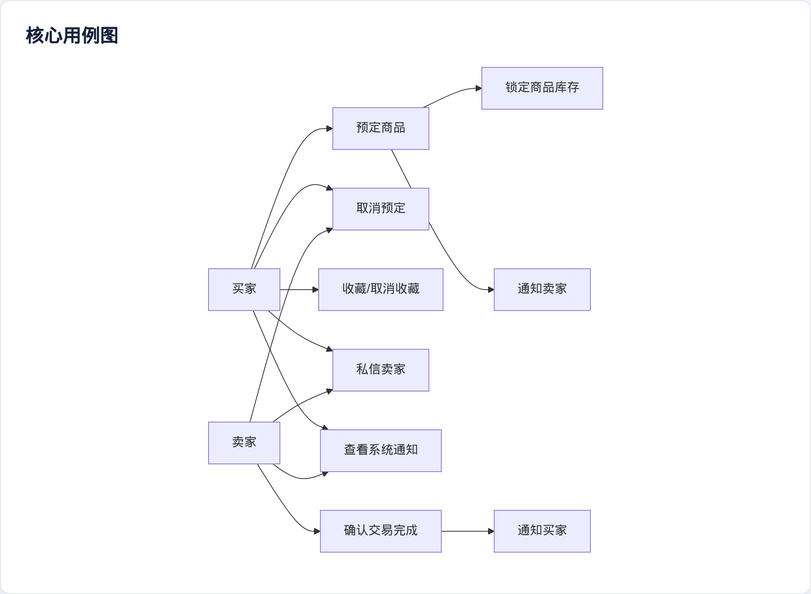
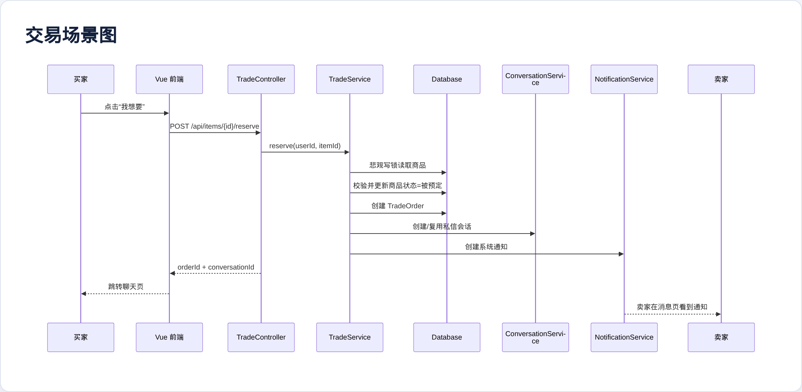
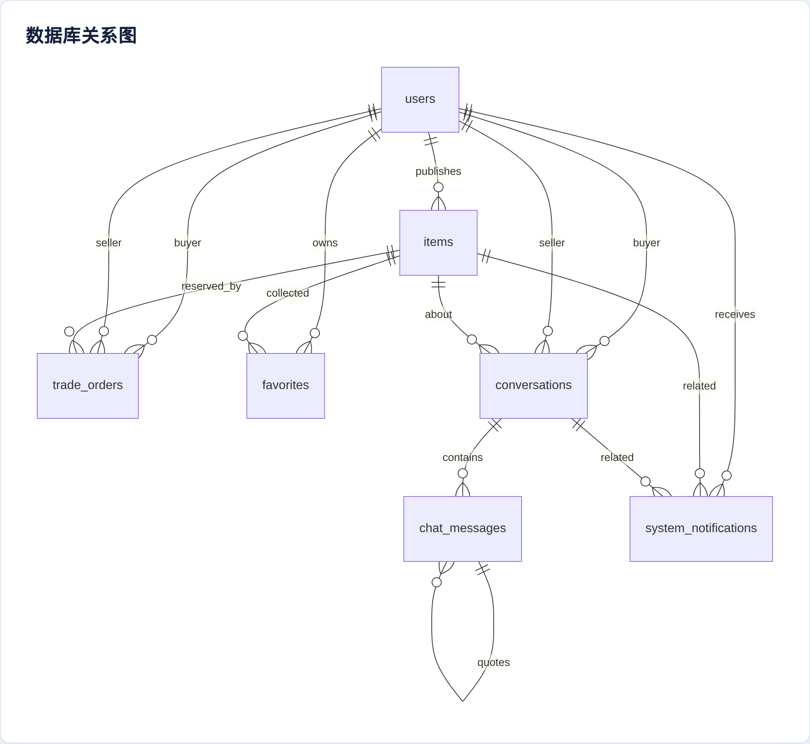
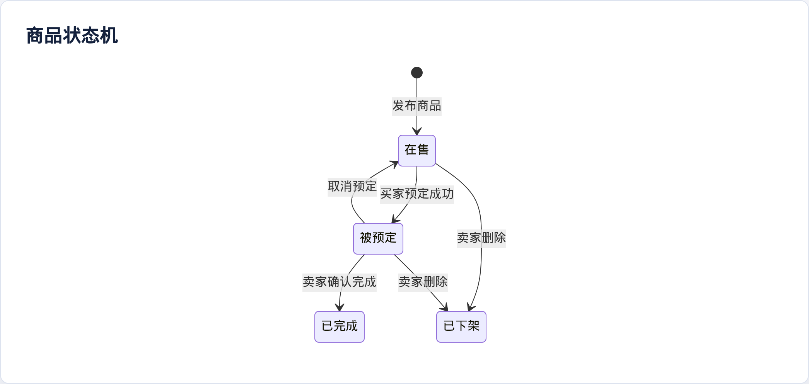
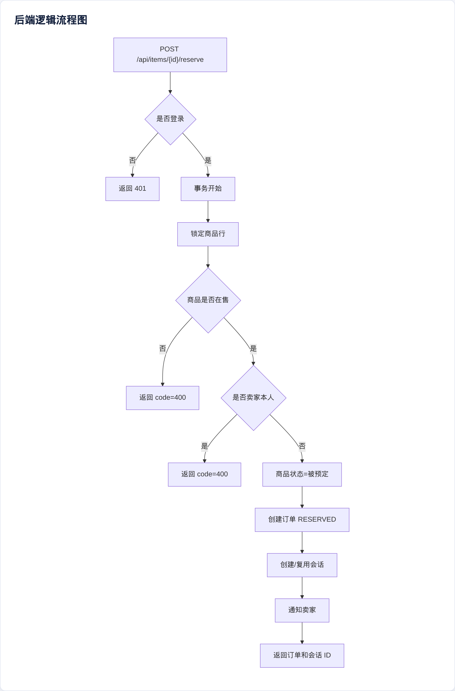
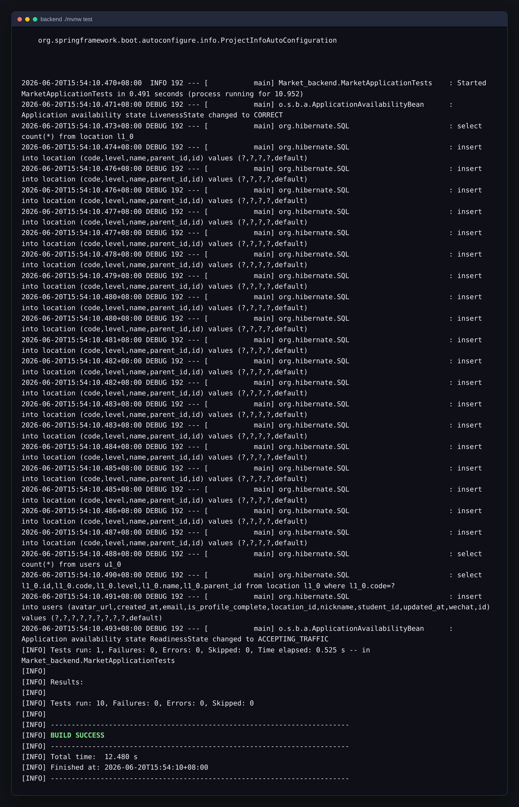
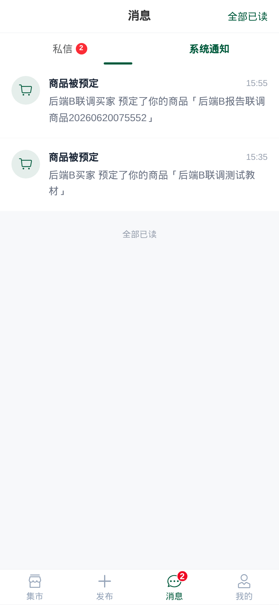

# 团队最终报告补充章节：后端开发 B 负责部分

> 本章节用于并入团队最终报告，覆盖后端开发 B 在分工中负责的《需求分析》《系统设计》和《程序开发》内容。后端 B 在后端 A 已完成的认证、用户、商品 CRUD、上传和地点树基础上，补齐交易闭环、收藏、私信和系统通知能力。

## 一、需求分析：核心交易流与消息通知

### 1. 后端 B 职责边界

根据团队分工，后端 B 负责核心业务开发，具体包括：

| 功能模块 | 需求说明 | 依赖基础 |
|---|---|---|
| 商品预定 | 买家点击“我想要”后锁定商品，避免其他买家继续预定 | 商品状态、当前用户识别 |
| 取消预定 | 买家或卖家可以取消未完成预定，商品重新回到在售状态 | 订单状态流转 |
| 交易完成 | 卖家确认线下面交完成，商品进入已完成状态 | 订单、商品、买卖双方 |
| 并发控制 | 同一商品同时被多人预定时只能成功一个 | 事务和行级锁 |
| 收藏 | 买家可以收藏或取消收藏商品，并在个人中心查看 | 当前用户、商品 ID |
| 私信 | 买家和卖家围绕商品建立会话，支持消息、引用、撤回和已读 | 用户、商品、会话 |
| 系统通知 | 预定、取消、完成等关键事件向对应用户发通知 | 业务事件和用户身份 |

### 2. 功能需求

- 买家可以预定在售商品；预定成功后商品状态变为“被预定”，并自动创建与卖家的私信会话。
- 卖家不能预定自己发布的商品；已下架、已被预定、已完成商品不能再次预定。
- 买家或卖家可以取消未完成预定；取消后商品恢复为“在售”。
- 卖家可以确认交易完成；完成后商品状态变为“已完成”，买家可在“我买到的”中查看。
- 买家可以收藏或取消收藏商品，商品详情页展示当前收藏态，个人中心展示收藏列表。
- 会话按关联商品组织，消息支持文本、引用回复、2 分钟内撤回、未读计数和已读清零。
- 系统通知展示预定、取消、完成事件，支持单条已读、全部已读和全局未读汇总。

### 3. 非功能需求

| 类型 | 要求 |
|---|---|
| 一致性 | 商品预定必须在事务中完成，商品状态和订单状态不能出现不一致 |
| 并发安全 | 对商品行加悲观写锁，避免两个买家同时预定成功 |
| 可维护性 | 继续使用 Controller、Service、Repository、Entity、DTO 分层 |
| 可测试性 | 使用 H2 test profile 和 MockMvc 覆盖交易、消息、通知 API |
| 兼容性 | 保持后端 A 的 `Result<T>` 格式和前端现有字段不变 |

### 4. 核心用例图



### 5. 交易场景图



## 二、系统设计：数据库、状态机与后端逻辑

### 1. 数据库设计

后端 B 新增 5 张表，均通过 JPA 实体映射，`db/schema.sql` 中同步保留结构说明，便于报告和答辩展示。

| 表 | 作用 | 关键字段 |
|---|---|---|
| `trade_orders` | 记录预定和交易状态 | `item_id`、`buyer_id`、`seller_id`、`status` |
| `favorites` | 记录用户收藏 | `user_id`、`item_id` 唯一约束 |
| `conversations` | 记录围绕商品的买卖双方会话 | `item_id`、`buyer_id`、`seller_id`、未读数 |
| `chat_messages` | 记录私信消息 | `conversation_id`、`sender_id`、`recipient_id`、`quote_message_id` |
| `system_notifications` | 记录系统通知 | `user_id`、`type`、`item_id`、`conversation_id`、`is_read` |

数据库关系如下：



### 2. 商品与订单状态机

商品状态继续使用中文，直接适配前端页面展示；订单状态使用英文常量，便于代码中判断。



订单状态流转：


### 3. 并发锁定设计

商品预定是后端 B 的关键一致性场景。实现时在 `ItemRepository` 中新增悲观写锁查询：

```text
findByIdForUpdate(itemId)
```

预定流程在一个事务中完成：

1. 使用悲观写锁读取商品；
2. 校验商品未删除且状态为“在售”；
3. 校验当前用户不是卖家；
4. 更新商品状态为“被预定”；
5. 创建 `TradeOrder`；
6. 创建或复用 `Conversation`；
7. 创建卖家系统通知。

由于第二个并发事务必须等待第一个事务提交，等它再次读取商品时状态已不再是“在售”，因此会返回业务错误，避免超卖。

### 4. 后端逻辑流程图



## 三、程序开发：代码组织与接口实现

### 1. 代码组织

后端 B 仍遵循后端 A 的分层结构：

```text
Market_backend
├── controller
│   ├── TradeController
│   ├── FavoriteController
│   ├── ConversationController
│   └── NotificationController
├── service
│   ├── TradeService
│   ├── FavoriteService
│   ├── ConversationService
│   └── NotificationService
├── entity
│   ├── TradeOrder
│   ├── Favorite
│   ├── Conversation
│   ├── ChatMessage
│   └── SystemNotification
├── repository
│   ├── TradeOrderRepository
│   ├── FavoriteRepository
│   ├── ConversationRepository
│   ├── ChatMessageRepository
│   └── SystemNotificationRepository
└── dto
    ├── OrderVO
    ├── ConversationVO
    ├── ChatMessageVO
    ├── NotificationVO
    └── UnreadSummaryVO
```

### 2. 主要 API

| 接口 | 功能 |
|---|---|
| `POST /api/items/{id}/reserve` | 预定商品，返回订单和会话 |
| `POST /api/orders/{id}/cancel` | 取消预定 |
| `POST /api/orders/{id}/complete` | 卖家确认完成 |
| `GET /api/orders/reserved` | 当前买家的预定列表 |
| `GET /api/orders/bought` | 当前买家的已完成交易列表 |
| `POST /api/items/{id}/favorite` | 收藏商品 |
| `DELETE /api/items/{id}/favorite` | 取消收藏 |
| `GET /api/favorites` | 收藏列表 |
| `POST /api/conversations` | 创建或复用会话 |
| `GET /api/conversations` | 私信列表 |
| `POST /api/conversations/{id}/messages` | 发送消息 |
| `POST /api/messages/{id}/recall` | 撤回消息 |
| `GET /api/notifications` | 系统通知列表 |
| `GET /api/messages/unread-summary` | 全局未读汇总 |

### 3. 前后端对接

后端 B 实现后，前端原有占位逻辑已替换为真实接口：

| 页面 | 对接内容 |
|---|---|
| `Detail.vue` | 收藏、预定、创建私信会话 |
| `Messages.vue` | 私信列表、通知列表、已读、删除会话 |
| `Chat.vue` | 消息列表、发送、引用、撤回 |
| `Profile.vue` | 我买到的、我的预定、我的收藏 |
| `AppTabbar.vue` | 全局未读数角标 |

## 四、测试与验收

### 1. 自动化测试

新增 `BackendBApiTests`，使用 H2 test profile 和 MockMvc 验证核心业务：

| 测试内容 | 验证点 |
|---|---|
| 预定商品 | 商品状态变为“被预定”，返回订单和会话 |
| 重复预定 | 第二个买家不能预定已锁定商品 |
| 完成交易 | 只有卖家可完成，完成后商品变“已完成” |
| 取消预定 | 订单取消后商品恢复“在售” |
| 收藏 | 收藏后详情页 `favorited=true`，收藏列表可见 |
| 私信 | 会话创建、消息发送、引用、未读、已读 |
| 撤回 | 非发送者不可撤回，发送者可在限制内撤回 |
| 通知 | 预定和完成生成通知，通知可标记已读 |

### 2. 验证命令

```bash
cd backend
./mvnw test
```

前端构建：

```bash
cd frontend
npm ci
npm run build
```

### 3. 验收结论

后端 B 完成后，系统从“商品发布与浏览”扩展为完整的校园二手交易闭环：买家可以收藏、预定、私信卖家，卖家可以完成交易，系统可以通过通知和未读角标提醒双方处理交易进展。该部分与后端 A 的安全认证、商品基础能力以及前端买家端页面形成完整联动。


## 五、运行截图与证据

### 1. 后端自动化测试通过截图



### 2. 前后端联调截图

下图展示买家预定商品后，卖家消息页出现“商品被预定”系统通知，说明预定状态、会话与通知链路已经联通。


