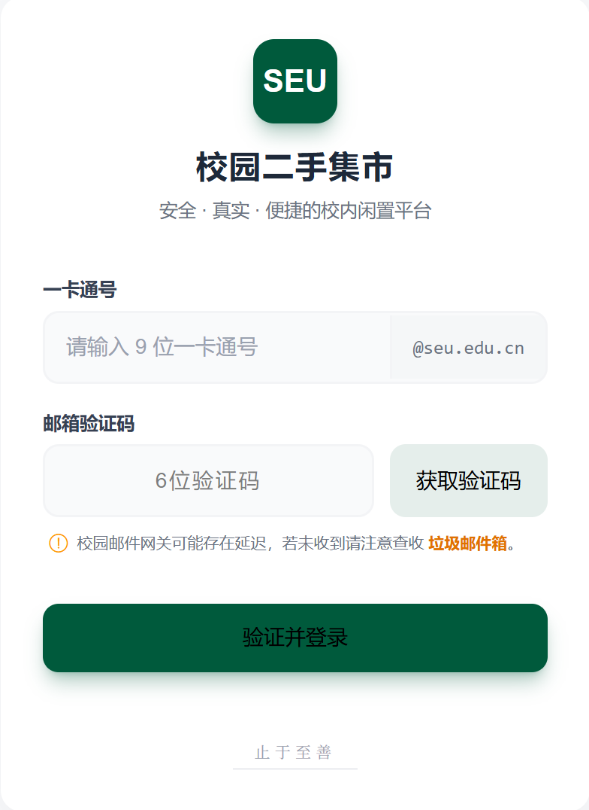
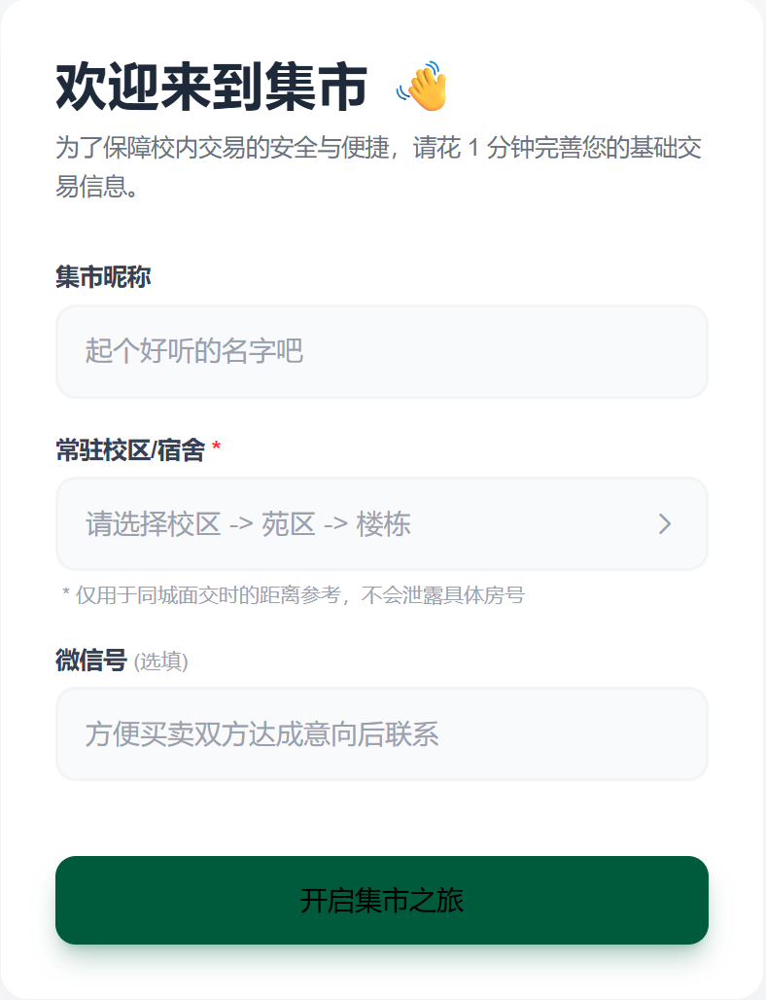
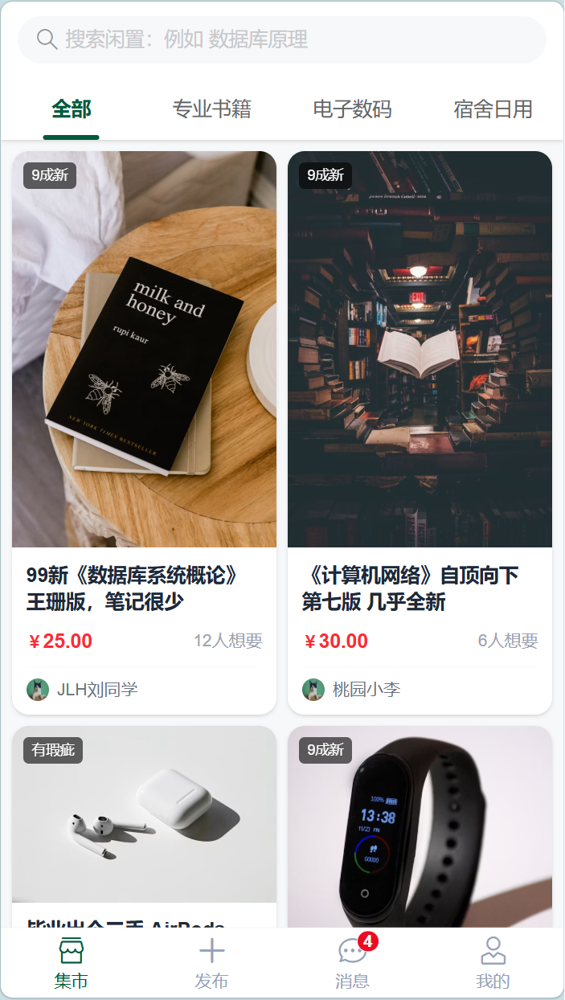
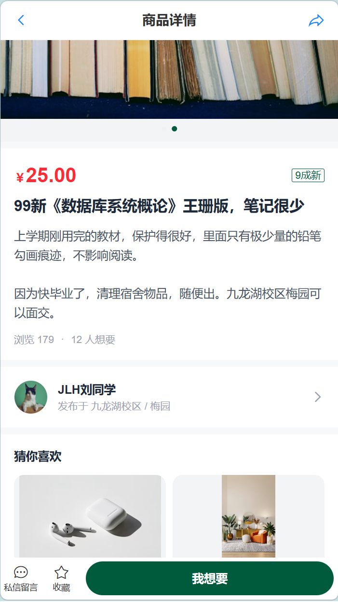
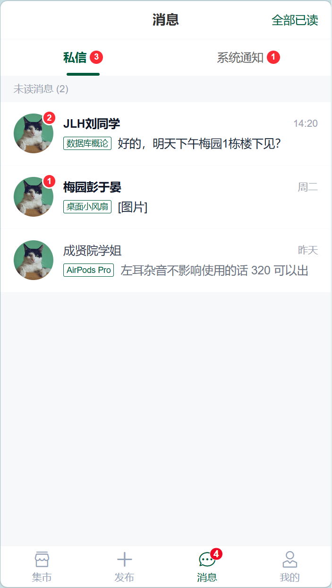
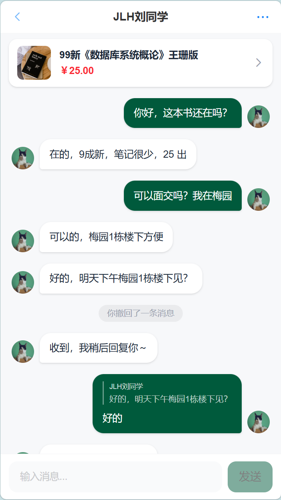
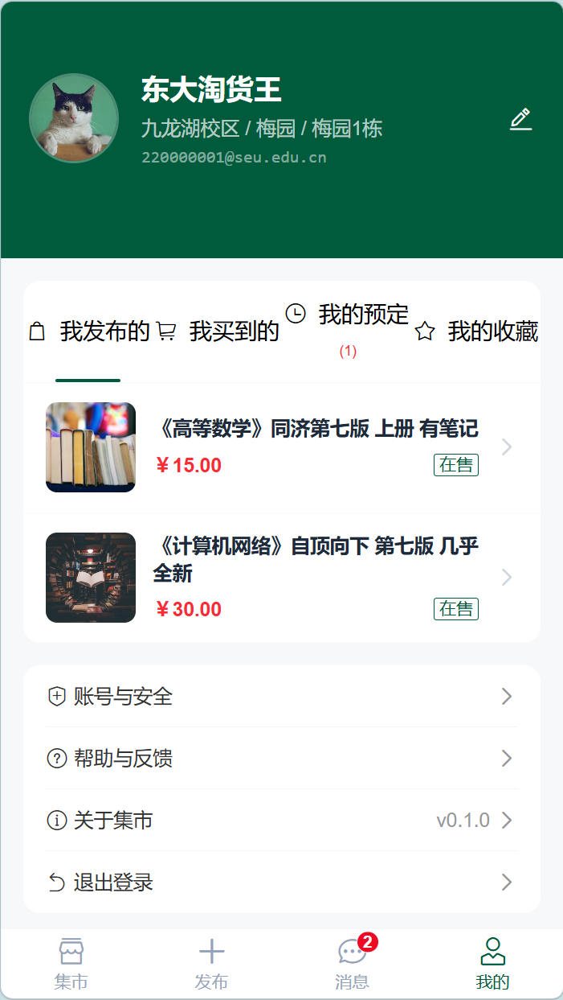

# 校园二手集市 — 买家端设计文档

**项目版本**: v0.1.0  
**技术栈**: Vue 3 + Vant 4 + Tailwind CSS 4 + Vue Router  
**目标用户**: 东南大学在校学生

---

## 一、需求分析（买家视角）

### 1.1 用户角色

| 角色 | 描述 |
|------|------|
| 未注册访客 | 持有一卡通号但未完善资料的新生/交换生，可登录但需先完成 onboarding |
| 已注册买家 | 已完成 onboarding 的在校生，可浏览、搜索、收藏、预定、私信卖家 |

### 1.2 业务场景与需求

#### 场景一：首次访问与身份认证
- **用户故事**: 作为东大学生，希望用一卡通号登录，确保只有校内人员使用平台。
- **需求要点**:
  1. 输入 9 位一卡通号 + 邮箱验证码登录
  2. 验证码发送至 `学号@seu.edu.cn`
  3. 首次登录后强制进入 onboarding 完善昵称和校区宿舍信息
  4. 支持 token 持久化，下次免登录

#### 场景二：浏览与发现闲置
- **用户故事**: 作为买家，希望快速浏览校内同学发布的闲置物品，按分类筛选。
- **需求要点**:
  1. 首页瀑布流展示所有在售商品，支持下拉刷新
  2. 顶部分类 tabs：全部 / 专业书籍 / 电子数码 / 宿舍日用
  3. 搜索栏支持按商品标题和卖家名称搜索
  4. 商品卡片展示：图片、成色标签、标题、价格、想要人数、卖家头像与昵称
  5. 骨架屏加载过渡，空状态引导

#### 场景三：查看商品详情
- **用户故事**: 作为买家，希望看到商品的完整信息，决定是否购买。
- **需求要点**:
  1. 图片轮播，支持点击全屏预览
  2. 展示价格、成色标签、标题、详细描述、浏览/想要人数
  3. 卖家信息卡片（头像、昵称、面交地点），点击进入私信
  4. "猜你喜欢"推荐，引导继续浏览
  5. 底部固定操作栏：私信留言 / 收藏 / 我想要（预定）

#### 场景四：预定商品
- **用户故事**: 作为买家，看中商品后希望标记"我想要"来锁定库存，并尽快与卖家协商面交。
- **需求要点**:
  1. 点击"我想要"弹出确认 ActionSheet
  2. 确认后商品标记为"被预定"状态
  3. 自动跳转到与卖家的私信聊天
  4. 收藏功能可随时切换

#### 场景五：即时通讯
- **用户故事**: 作为买家，想与卖家实时沟通，询问细节、砍价、约定面交。
- **需求要点**:
  1. 私信列表展示所有对话，按未读优先排序
  2. 每条私信显示关联商品标签
  3. 聊天页面支持发送文字、引用回复、2分钟内撤回
  4. 对方自动回复模拟
  5. 聊天内可快捷跳转商品详情
  6. 左滑删除会话

#### 场景六：消息通知
- **用户故事**: 作为买家，希望及时收到系统通知和私信提醒。
- **需求要点**:
  1. 消息页分为"私信"和"系统通知"两个 tab
  2. 各 tab 显示未读红点/数字角标
  3. 支持一键全部已读
  4. 底部 tabbar 显示全局未读汇总角标

#### 场景七：个人中心与订单管理
- **用户故事**: 作为买家，想管理个人资料、查看购买/预定/收藏记录。
- **需求要点**:
  1. 展示头像、昵称、校区、学号
  2. 四个 tab 列表：我发布的 / 我买到的 / 我的预定 / 我的收藏
  3. 每个商品显示状态标签（在售 / 被预定 / 已完成）
  4. 支持编辑昵称和微信号
  5. 退出登录

---

## 二、用户界面设计（UI/UX）

### 2.1 页面总览

| 路由 | 页面 | 说明 |
|------|------|------|
| `/login` | 登录 | 一卡通号 + 验证码，校园邮箱认证 |
| `/onboarding` | 新人引导 | 昵称 + 校区地址 + 微信号 |
| `/home` | 集市首页 | 搜索 + 分类 + 商品瀑布流 |
| `/item/:id` | 商品详情 | 轮播图 + 信息 + 卖家 + 操作栏 |
| `/messages` | 消息列表 | 私信 tab + 系统通知 tab |
| `/chat/:id` | 聊天页面 | 即时消息 + 引用 + 撤回 |
| `/profile` | 个人中心 | 资料 + 商品 tab + 设置 |

### 2.2 页面原型与交互说明

---

#### 2.2.1 登录页 `/login`

**原型截图**:

**交互说明**:

| 元素 | 交互 |
|------|------|
| Logo | 默认正常，鼠标悬浮时 `-rotate-6` 倾斜动画 (300ms) |
| 一卡通号输入框 | 输入 9 位数字，正则校验 `/^[0-9]{9}$/` |
| 获取验证码 | 校验一卡通号 → 调用 `POST /auth/send-code` → 60s 倒计时 → 按钮禁用 |
| 验证码输入 | 开发期固定 `123456` 可用 |
| 登录按钮 | 调用 `POST /auth/login` → 成功存 token → 新用户跳 `/onboarding`，老用户跳 `/home` |
| 错误提示 | 均使用 Vant Toast 顶部弹出 |

---

#### 2.2.2 新人引导页 `/onboarding`

**原型截图**:

**交互说明**:

| 元素 | 交互 |
|------|------|
| 地址选择 | 三级级联选择器：校区 → 苑区 → 楼栋 |
| 校区覆盖 | 九龙湖（梅园/桃园/橘园）、四牌楼（成贤院/沙塘园）、丁家桥（求恩坊） |
| 提交 | 校验地址必填 → 调 API 保存 → 跳 `/home` |

---

#### 2.2.3 集市首页 `/home`

**原型截图**:

**交互说明**:

| 元素 | 交互 |
|------|------|
| 搜索栏 | 输入关键词 → 按标题/卖家名实时过滤；支持清空 |
| 分类 tabs | 切换触发过滤；选中色 `#005A3C`；滑动阈值 4 个 |
| 瀑布流 | CSS `columns-2` 实现，每张卡片 `break-inside-avoid` |
| 商品卡片 | 点击跳转 `/item/:id`；按下 `scale-[0.98]` 反馈 |
| 下拉刷新 | Vant PullRefresh，模拟 800ms 延迟后提示已更新 |
| 加载态 | 4 个骨架屏卡片（交替高度 160/200px） |
| 空状态 | 搜索无结果 → 搜索图标 + 重置按钮；分类无结果 → 空商品提示 |

---

#### 2.2.4 商品详情页 `/item/:id`

**原型截图**:

**交互说明**:

| 元素 | 交互 |
|------|------|
| 图片轮播 | 3s 自动轮播，swipe 指示器深绿；点击打开 ImagePreview 全屏 |
| 导航栏 | 左箭返回，右分享按钮（Web Share API / 复制链接） |
| 卖家卡片 | 点击 push 到 `/chat/:id` |
| 收藏按钮 | toggle 切换，变色 + Toast 反馈 |
| 我想要 | 弹出 ActionSheet: "确认预定此商品？" → 确认 → 锁库存 Toast → 1.5s 后跳聊天 |
| 猜你喜欢 | 排除当前商品，随机取 2 个，点击可跳转 |
| 骨架屏 | 进入时 300ms 加载态 |

---

#### 2.2.5 消息列表页 `/messages`

**原型截图**:

**交互说明**:

| 元素 | 交互 |
|------|------|
| 私信列表 | 按未读优先排序；显示未读数字角标（封顶 99+） |
| 左滑删除 | Vant SwipeCell 红色删除按钮 |
| 点击会话 | `markChatAsRead` → 跳转 `/chat/:id` |
| 系统通知 | 圆点未读标记；点击标记已读；切 tab 自动全部已读 |
| 全部已读 | 仅在私信 tab 有未读时显示 |
| tabbar 角标 | 汇总私信 + 通知未读，`>99` 显示 `99+` |

---

#### 2.2.6 聊天页面 `/chat/:id`

**原型截图**:

**交互说明**:

| 元素 | 交互 |
|------|------|
| 关联商品 | 点击跳转商品详情；展示封面图、标题、价格 |
| 消息列表 | 自动滚动到底部；自己消息深绿背景右对齐，对方白色左对齐 + 头像 |
| 引用回复 | 长按消息 → 弹出 ActionSheet → "引用" → 输入框上方出现引用条 → 发送时附带 quote |
| 消息撤回 | 长按 → "撤回" → 仅 2 分钟内自己的消息可撤回 → 显示"你撤回了一条消息" |
| 复制 | 长按 → "复制" → 内容写入剪贴板 |
| 对方自动回复 | 发送后 1.2s 模拟回复"收到，我稍后回复你～" |
| 发送按钮 | 空内容禁用；Enter 键也可发送 |
| 举报 | 右上角菜单 → "举报该用户" → Toast 提示 |

---

#### 2.2.7 个人中心 `/profile`

**原型截图**:

**交互说明**:

| 元素 | 交互 |
|------|------|
| 编辑资料 | 点击 ✏️ 图标 → 底部弹出 Popup → 编辑昵称/微信号 |
| 商品 tabs | 四个 tab：我发布的 / 我买到的 / 我的预定 / 我的收藏；通过 URL `?tab=` 保持状态 |
| 商品状态 | 颜色编码：在售 `#005A3C` / 被预定 `#ed6a0c` / 已完成 `#969799` |
| 退出登录 | 确认弹窗 → 清除 token → 跳转 `/login` |
| 设置项 | 账号安全/帮助反馈 → Toast "功能开发中" |
